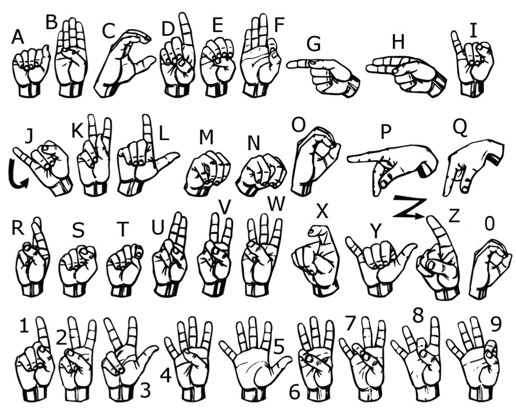

# ASL_final_project

## ASL - American Sign Language



# Sign Language Gesture Classifier

Классификация жестов американского жестового языка (ASL) с использованием PyTorch Lightning, EfficientNetV2 и MLOps-инструментов.

## Описание проекта

Цель проекта — построить систему классификации жестов по изображению руки. В рамках проекта:

- Используется датасет с 20 статичными жестами (буквы и цифры)
- Реализована модель на EfficientNetV2 с PyTorch Lightning
- Поддерживаются этапы тренировки, инференса и конвертации в ONNX
- Используются Hydra, DVC, MLflow, pre-commit и Poetry

## Setup

1. Установи Poetry (если ещё нет):

```
curl -sSL https://install.python-poetry.org | python3 -
```

2. Клонируй репозиторий и установи зависимости:

```
git clone https://github.com/<твой-ник>/sign-language-classifier.git
cd sign-language-classifier
poetry install
poetry shell
```

3. Установи pre-commit и прогоните хуки:

```
poetry run pre-commit install
poetry run pre-commit run -a


```

4. Восстанови данные (через DVC):

```
dvc pull
```

5. Тренировка модели

```
python src/train.py
```

6. Инференс

```
python src/infer.py image=path/to/image.jpg
```

## Подготовка к продакшену

```
python src/convert.py --checkpoint path/to/checkpoint.ckpt
```

### Логирование

Для локального трекинга моделей используется MLflow.

адрес по умолчанию: http://127.0.0.1:8080

## Зависимости

Все зависимости управляются Poetry. Основные:

torch, pytorch-lightning, timm, hydra-core

mlflow, dvc, pre-commit, black, flake8, isort
